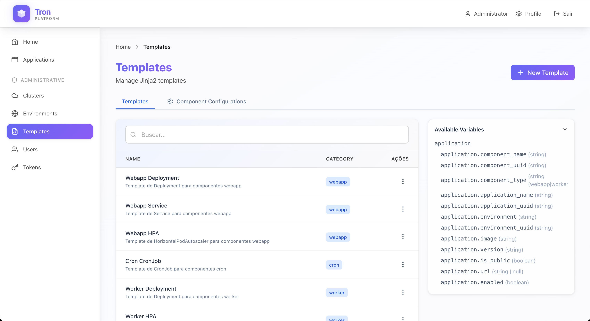
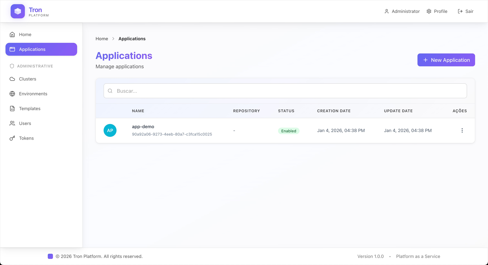
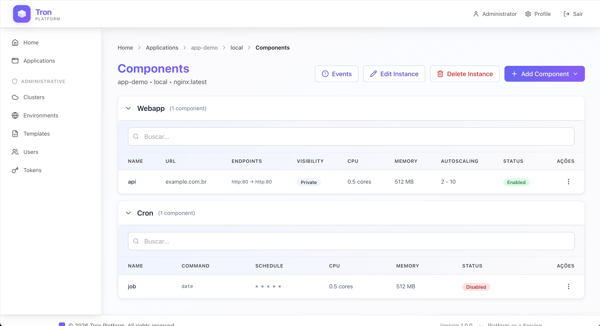

# Tron - Platform as a Service

PaaS platform built on top of Kubernetes that simplifies application deployment and management.

## 📸 Platform Overview

### Dashboard
The dashboard provides a comprehensive overview of your platform, including statistics, component breakdown, and resource distribution across environments and clusters.


### Templates
Manage reusable Kubernetes templates with Jinja2 templating. Create and configure templates for different component types (webapp, worker, cron) with customizable variables.



### Applications
Organize and manage your applications. Each application can have multiple instances deployed across different environments with independent configurations.



### Instance Details
View and manage components within an instance. Configure webapps, workers, and cron jobs with their specific settings, monitor their status, and access detailed information.



## 🚀 Quick Start

### Prerequisites

- Docker
- Docker Compose

### Running the Project

Run a single command to start the entire environment:

```bash
make start
```

This command will:
- ✅ Start the FastAPI API (http://localhost:8000)
- ✅ Start the React Portal (http://localhost:3000)
- ✅ Start the PostgreSQL database
- ✅ Start the Kubernetes cluster (K3s)
- ✅ Run database migrations
- ✅ Load initial templates
- ✅ Create default administrator user
- ✅ Configure API token
- ✅ Create "local" environment
- ✅ Configure local cluster

### Access the Portal

After running `make start`, access:

**URL**: [http://localhost:3000](http://localhost:3000)

**Default credentials**:
- **Email**: `admin@example.com`
- **Password**: `admin`

## 📚 API Documentation

Interactive API documentation is available at:
- **Swagger UI**: [http://localhost:8000/docs](http://localhost:8000/docs)
- **ReDoc**: [http://localhost:8000/redoc](http://localhost:8000/redoc)

## 🛠️ Useful Commands

### Environment Management

```bash
# Start environment
make start

# Stop environment
make stop

# View logs
make logs

# Check service status
make status

# Rebuild images
make build
```

### Database Migrations

```bash
# Create new migration
make api-migration

# Apply migrations
make api-migrate
```

### Using kubectl with K3s

To interact with the local K3s cluster:

```bash
export KUBECONFIG=./volumes/kubeconfig/kubeconfig.yaml
kubectl get nodes
```

## 🏗️ Architecture

The project is organized as a monorepo containing:

- **API** (`/api`): FastAPI backend with cluster, environment, application, and template management
- **Portal** (`/portal`): React frontend for user interface
- **Scripts** (`/scripts`): Automation and setup scripts

## 🔐 Authentication

The platform supports two authentication methods:

1. **JWT (JSON Web Tokens)**: For web portal users
2. **API Tokens**: For programmatic access via `x-tron-token` header

### User Roles

- **Admin**: Full access to all resources
- **User**: Limited access (read-only on administrative resources)
- **Viewer**: Read-only access

## 📖 Main Features

- **Cluster Management**: Add and manage Kubernetes clusters
- **Environments**: Organize resources by environments (dev, staging, production)
- **Applications**: Application deployment and management
- **Templates**: Reusable templates for components
- **Users**: User and permission management
- **API Tokens**: Tokens for programmatic access

## 🏛️ Core Concepts

### Applications, Instances, and Components

The platform organizes deployments using a hierarchical structure:

#### **Application**
An application represents a software project or service. It's the top-level entity that groups related deployments.

**Example**: `my-api`, `frontend-app`, `data-processor`

#### **Instance**
An instance is a deployment of an application in a specific environment. Each instance defines:
- **Image**: Docker image to deploy (e.g., `my-app:1.0.0`)
- **Version**: Version tag of the image
- **Environment**: Where it's deployed (dev, staging, production)

**Key points**:
- One application can have multiple instances (one per environment)
- Each instance is unique per application + environment combination
- Instances contain one or more components

**Example**:
- Application: `my-api`
  - Instance 1: `my-api` in `dev` environment (image: `my-api:1.0.0`)
  - Instance 2: `my-api` in `production` environment (image: `my-api:2.1.0`)

#### **Component**
A component is a functional part of an instance that gets deployed to Kubernetes. Each component has:
- **Type**: `webapp`, `worker`, or `cron`
- **Name**: Unique identifier within the instance
- **Settings**: Component-specific configuration (JSON)
- **Public URL**: Optional public endpoint (for webapps)

**Component Types**:
- **webapp**: Web application with HTTP/HTTPS access
- **worker**: Background worker process
- **cron**: Scheduled job (cron job)

**Example**:
- Instance: `my-api` in `production`
  - Component 1: `api-server` (type: `webapp`, public URL: `https://api.example.com`)
  - Component 2: `email-worker` (type: `worker`)
  - Component 3: `daily-report` (type: `cron`, schedule: `0 0 * * *`)

### Gateway API Requirements

For webapp components, the platform supports three visibility modes:

- **Cluster**: Accessible only within the Kubernetes cluster via Service (default, always available)
- **Private**: Internal access with Gateway API routing (requires Gateway API)
- **Public**: External access with public endpoint (requires Gateway API)

**Important**: To use **Public** or **Private** visibility modes, you must have a Gateway API component installed and configured in your Kubernetes cluster. The Gateway API provides the necessary resources (`HTTPRoute`, `TCPRoute`, `UDPRoute`) to route traffic to your webapp components.

**Requirements for Public/Private visibility**:
1. Gateway API CRDs must be installed in the cluster
2. A Gateway resource must be created and configured in the cluster
3. The Gateway must be properly referenced (namespace and name) in the cluster configuration

If no Gateway is configured in the cluster, only the **Cluster** visibility mode will be available for webapp components.

### Hierarchy Summary

```
Application
  └── Instance (per environment)
      ├── Component (webapp)
      ├── Component (worker)
      └── Component (cron)
```

This structure allows you to:
- Deploy the same application to multiple environments with different configurations
- Manage different component types (web, workers, cron jobs) within the same instance
- Scale and configure each component independently

## 🔧 Development

### Project Structure

```
tron/
├── api/              # FastAPI backend
├── portal/           # React frontend
├── scripts/          # Automation scripts
├── docker/           # Docker Compose configurations
└── volumes/          # Persistent volumes (kubeconfig, tokens)
```

### Environment Variables

Main environment variables can be configured in the `docker/docker-compose.yaml` file or through `.env` files.

---

**Built with ❤️ to simplify Kubernetes application management**
